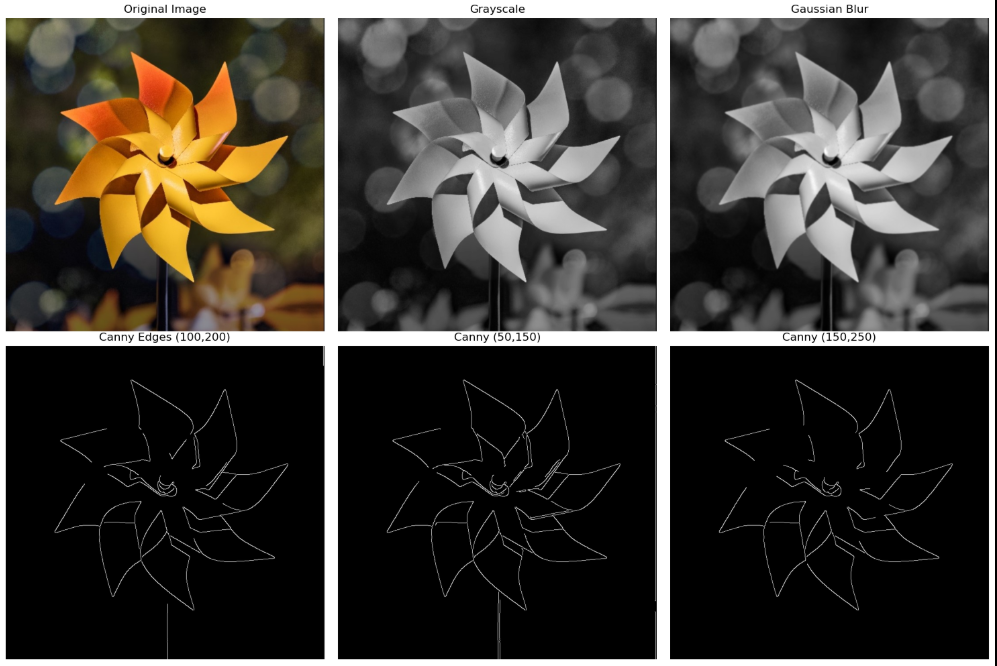

# Canny Edge Detection — Simple README

## Overview

This project demonstrates **Canny Edge Detection** using Python and OpenCV.
The algorithm detects sharp changes in intensity (edges) and highlights the boundaries of objects in an image.

## Steps Performed

1. Load the input image
2. Convert it to grayscale
3. Apply Gaussian Blur to reduce noise
4. Apply Canny Edge Detection
5. Display the original and edge-detected images

## Features

* Adjustable thresholds for tuning edge detection
* Clean visualization using Matplotlib
* Beginner-friendly code structure

## Requirements

Install dependencies:

```
pip install opencv-python matplotlib
```

## How to Run

Run the Python file:

```
python canny_edge_detection.py
```

## Output

### Original Image:


### Edge Detection:



